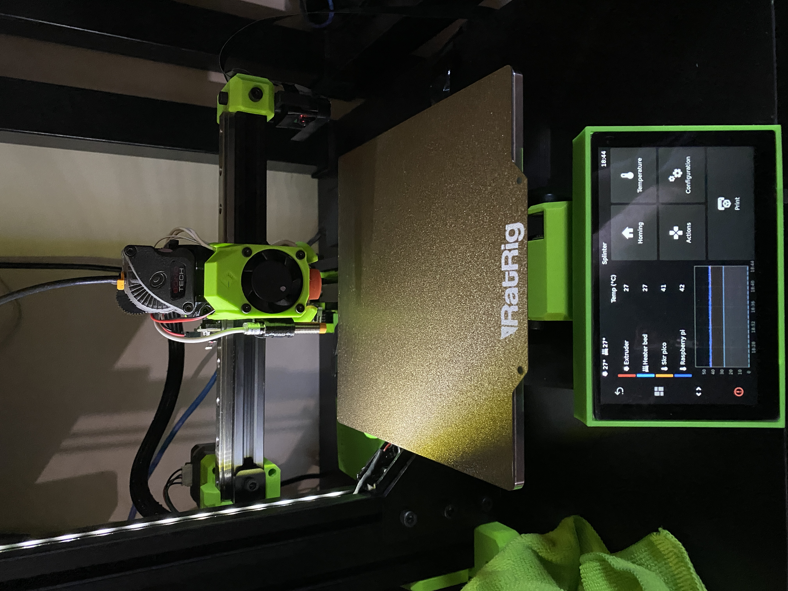

## RatRig V-Minion

- mods:
    - [Z-Cap Bowden mount](https://www.printables.com/model/167607-z-cap-v-minion-bowden-ptfe-integrated)
    - [Y-Axis drag chain](https://www.printables.com/model/155232-new-ratrig-v-minion-y-axis-drag-chain-compatible-w)
    - [OSOYOO 5" DSI LCD](https://osoyoo.store/products/osoyoo-5-inch-dsi-touchscreen-lcd-display-for-raspberry-pi?variant=32173136838767) mounted in custom case on [this arm](https://www.printables.com/model/147431-rat-rig-v-minion-tft35-v3-arm-and-case)
    - [Meanwell UHP-350-24 sidemounted](https://www.printables.com/model/121864-meanwell-uhp-350-24-mount-for-ratrig-v-minion-3d-p)
    - [Nero3D's pico + controller box](https://www.printables.com/model/166433-rr-vminion-skr-pico-controller-box)
    - 24V LED strip
    - Raspicam X-arm mount
