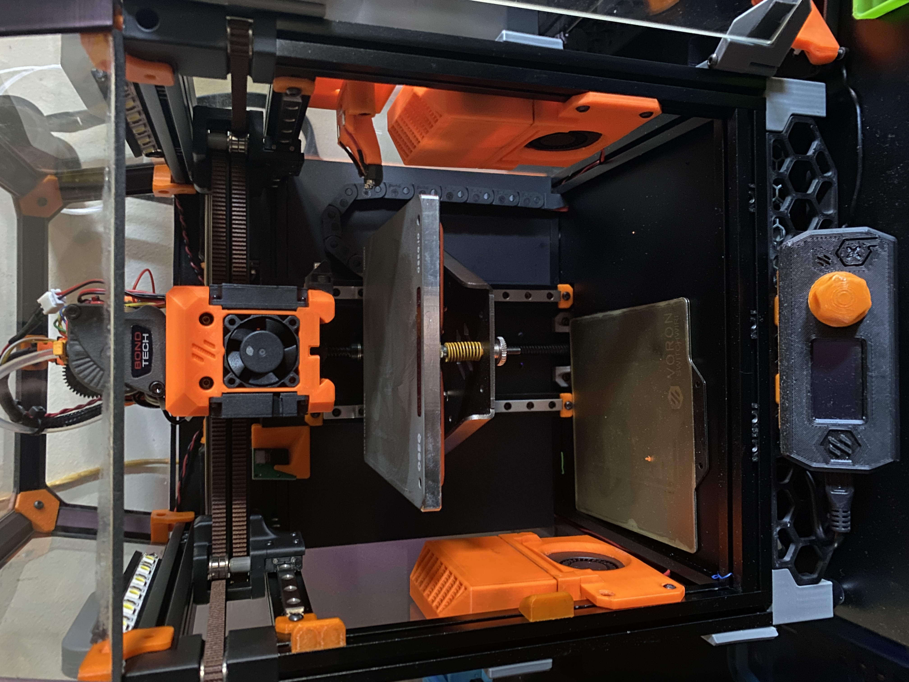

## Voron v0.1

- mods:
    - chirpy's [Dragon Burner](https://github.com/chirpy2605/voron/tree/main/V0/Dragon_Burner)
    - Mellow UTOC-1
    - Mellow SHT36v2
    - Sensorless X
    - Kirigami bed
    - WAGO mounts
    - Bed screw "tabs"
    - Zerofilter (x2)
    - MiniAB cowl w/integrated Klicky probe mount
    - Klicky probe
    - 2x24v LED strip (x2)
    - Hex rear panel
    - Raspi camera mount
    - v0 Display
    - No drop nuts
    - Hex rear panel
    - Fabreeko MiniAB fan kit
    - Detachable spool holder
    - 2-part rear top panels
    - Deck collar
    - PSU + Ethernet extension skirt
    - Modesty skirts
