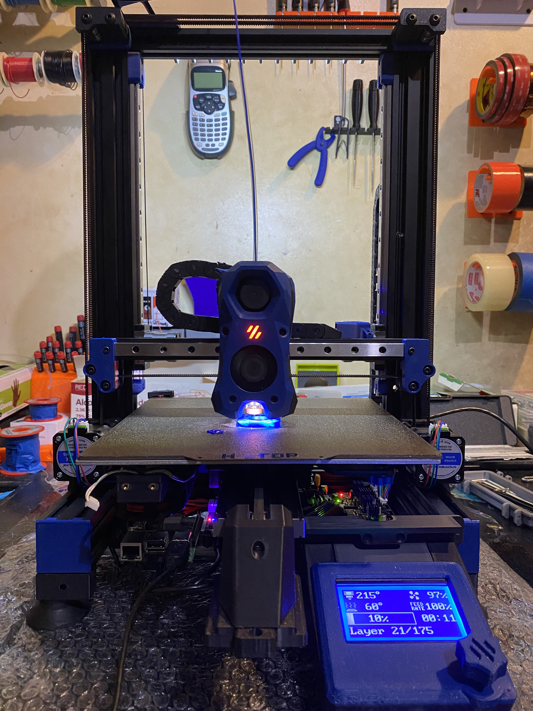

## Voron Switchwire / Ender 3 v2 conversion

- mods:
    - SKR Mini E3 v2
    - XYZ : OMC 17HS15-1504S-X1 ~ 1.8 degree steppers
    - MellowFly SB2040 CAN board + UTOC-1 CAN bridge adaptor
    - E : LDO-36STH17-1004AHG ~ 1.8 degree stepper
    - Revo Voron
    - Stock Ender3 220W/24V bed, lol
    - Omron inductive probe (after giving up on nozzle probe / Quickdraw for various reasons)
